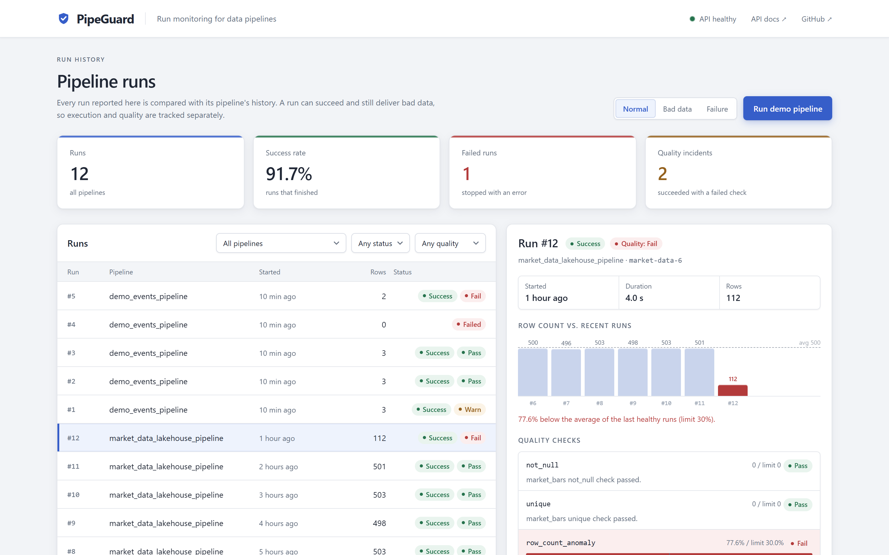

# PipeGuard — Data Pipeline Run Monitor

[](https://github.com/Ericliu-eng/pipeguard/actions/workflows/ci.yml)


A run monitor for data pipelines: each pipeline reports its finished runs over an authenticated API, and PipeGuard keeps their history, catches what a single run cannot see about itself — such as a row count that collapsed against previous runs — and explains each incident by the check that failed. It monitors the [de-lakehouse-pipeline](https://github.com/Ericliu-eng/de-lakehouse-pipeline) market-data warehouse.

**[Live dashboard](https://pipeguard-fn1b.onrender.com)** · [API docs](https://pipeguard-fn1b.onrender.com/docs) · free tier, so the first load can take about a minute


<sub>Illustrated flow, not a recording. Rendered by [`docs/demo/render_flow.py`](docs/demo/render_flow.py) · [static frame](docs/demo/pipeguard-flow.png)</sub>

## What it catches

| Situation | Result | Proof |
| --- | --- | --- |
| Rows collapse but every row is valid | **Anomaly `FAIL`** (e.g. 112 rows vs. an average of 500) while `status` stays `SUCCESS`; a failed batch never lowers the baseline | Last 5 healthy runs, 30% limit · [tests](tests/test_ingest.py) |
| A pipeline retries a report | **Same data → `200` with the stored run; different data → `409`** | Unique index on `(pipeline_name, external_run_id)` · [tests](tests/test_ingest.py) |
| The database goes away | **`/health` answers `503`**, and an unreachable database fails the boot instead of hanging it | Bounded connect timeout · [health](tests/test_health.py), [boot](tests/test_migrations.py) |
| A check fails and someone has to act | **Advice for the check that failed**, not a generic "check for nulls" | Rule-based, per check · [tests](tests/test_incident_analysis.py) |

## How it works

- **Cross-run checks:** a pipeline can only check its own batch. PipeGuard adds a `row_count_anomaly` check against that pipeline's recent healthy runs — history only the monitor keeps.
- **Two states per run:** `status` says whether the run finished, `quality_status` whether its data passed, so a run can succeed and still be flagged.
- **Safe ingestion:** each report is fingerprinted with SHA-256 so retries are idempotent; the API key is compared in constant time, and an unset key closes the endpoint.
- **Hardened in production:** the first `/health` returned a constant `200` for two months while its database was gone, and a SQLAlchemy minor release broke production behind a SQLite-only suite. The health check now probes the database, dependencies are pinned to minor releases, and CI runs every test on PostgreSQL 18 as well.
- **Migrations that adopt existing data:** Alembic took over a database created by `create_all`, and data migrations are tested on rows in the old format.

More in [docs/API.md](docs/API.md): the run-report contract, retry semantics, and pagination.

## Quick start

```bash
docker compose up --build
```

Open **http://localhost:8000**, pick **Bad data**, and click **Run demo pipeline**. Select the run to see each check against its limit, then click **Analyze run**. The API docs are at `/docs`.

<details>
<summary>Run without Docker (SQLite)</summary>

```bash
python -m pip install -e ".[dev]"
alembic upgrade head
uvicorn pipeguard.main:app --app-dir backend --reload
```

Set `INGEST_API_KEY` to accept runs on `POST /runs`; see [configuration](docs/OPERATIONS.md#configuration).
</details>

<details>
<summary>Dashboard screenshot</summary>


</details>

## Tests

```bash
python -m pip install -e ".[dev]"
pytest -q
```

CI runs the same suite twice, on SQLite and on PostgreSQL 18, and checks formatting with Ruff. Set `TEST_DATABASE_URL` to run it on PostgreSQL locally.

## Documentation

| Topic | Document |
| --- | --- |
| Endpoints and the run-report contract | [docs/API.md](docs/API.md#reporting-a-run) |
| Run history, filters, and pagination | [docs/API.md#run-history](docs/API.md#run-history) |
| Configuration and deployment | [docs/OPERATIONS.md](docs/OPERATIONS.md#configuration) |
| Migrations | [docs/OPERATIONS.md#database-migrations](docs/OPERATIONS.md#database-migrations) |
| Data model | [docs/schema.md](docs/schema.md) |
| Problem statement | [docs/problem-statement.md](docs/problem-statement.md) |
| Limitations and next steps | [docs/OPERATIONS.md#known-limitations-and-next-steps](docs/OPERATIONS.md#known-limitations-and-next-steps) |
| Animation source | [docs/demo/render_flow.py](docs/demo/render_flow.py) |
